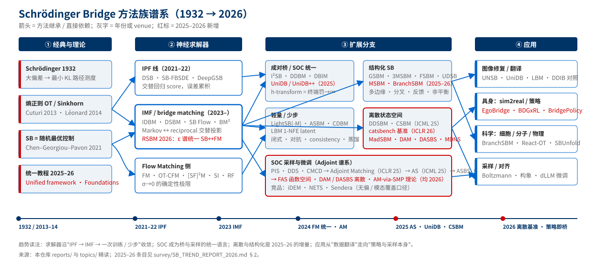

# Schrödinger Bridge 趋势报告 2026

> awesome_Schrödinger_Bridge · 综合调研报告 · 2026-09-01
> 覆盖：25 篇核心精读 + 20 份专题笔记 + 69 篇扩展条目（其中 21 篇为 2025–2026 新增，检索日 2026-09-01）
> 证据口径：每条论断后括注来源——`R:` 逐篇精读（`reports/`）、`E:` 专题（`topics/`）、`arXiv:` 论文页、`ICLR/ICML:` 会议页。无来源的判断以「判断」标出。

---

## §0 TL;DR

1. **IMF 已取代 IPF 成为 SB 求解的默认范式，竞争焦点转到"一次训练 + 少步采样"。** DSBM 把 SB 求解写成交替的 Markov / reciprocal 投影，避开 IPF 的误差累积（arXiv:2303.16852）；SB Flow 用 α-IMF 在线微调、无需缓存（R:2409.09347）；RSBM 证明条件速度场在整个熵正则 ε 谱上函数形式不变，同一网络覆盖 SB（ε=1）到 OT（ε→0），视觉导航 3 步积分达 92% 成功率（arXiv:2604.05673）。
2. **随机最优控制（SOC）成为统一语言。** UniDB 证明 Doob h-transform 类桥（DDBM、I²SB 一族）是 SOC 终端罚系数 →∞ 的特例（ICML 2025）；Adjoint Matching 把 SOC 变成回归问题，衍生出 AS / ASBS / FAS / DAM / DASBS 整条采样与微调谱系（R:2504.11713、R:2506.22565、R:2511.06239、R:2602.07132、R:2602.08243）；2026 年 SMP 视角给它补上了严格地基（arXiv:2604.08580）。
3. **离散状态空间是 2025–2026 增长最快的分支，且从"翻译"转向"采样与微调"。** CSBM 证明离散时间 IMF 收敛（ICML 2025）→ catsbench 给出首个有解析解的离散 SB 基准（ICLR 2026）→ MadSBM 用 ESM-2 logits 做参考过程设计肽序列（arXiv:2601.22408）→ DAM 微调 LLaDA-8B 做数学推理、DASBS 做离散能量采样（R:2602.07132、R:2602.08243）。
4. **结构先验决定应用能否落地：多边缘、分叉、反馈、非平衡、函数空间。** 3MSBM / MSBM 处理多时间点快照（R:2506.10168、arXiv:2510.16587）；BranchSBM 学分叉速度场与质量增长，单分支 SBM 在细胞命运分叉上模式塌缩（ICLR 2026）；FAS 把 adjoint 采样推到函数空间（R:2511.06239）。
5. **在具身智能里，SB 的角色正从"数据翻译器"变成"策略本身"。** BridgePolicy 把观测嵌入 SDE、从观测先验而非高斯噪声出发采样动作，52 个仿真任务 + 5 个真机任务优于现有生成式策略（ICML 2026）；BDGxRL 用 DSB 对齐源/目标域转移动力学（R:2602.23737）。但整条线仍缺真机评估的统计协议（R10 审查结论，见 §5）。

---

## §1 全景：SB 方法族谱系

| 层 | 代表工作 | 一句话 | 精读/专题 |
|---|---|---|---|
| 经典 | Schrödinger 1932；Léonard 2014 综述；Chen–Georgiou–Pavon SIAM Review 2021 | SB = 以参考过程为基准的最小 KL 路径测度 = 动态熵正则 OT；离散化后每步 IPF 就是 Sinkhorn | README §1 |
| 神经求解器 I（IPF） | DSB（NeurIPS 2021）、SB-FBSDE（ICLR 2022）、DeepGSB（NeurIPS 2022） | 交替回归前/后向 score；SB-FBSDE 给出似然目标；DeepGSB 把平均场代价写进 SB | R:2209.09893、E01 |
| 神经求解器 II（IMF / bridge matching） | IDBM（JMLR 2023）、DSBM（NeurIPS 2023）、SB Flow（NeurIPS 2024）、BM²（TMLR 2024） | 桥混合 → Markov 化 → 迭代收敛到 SB；第一次迭代已是合法 transport | E01、E02、R:2409.09347 |
| 成对桥 | I²SB（ICML 2023）、DDBM（ICLR 2024）、DBIM（ICLR 2025）、UniDB（ICML 2025） | 从信息丰富的 source 出发的 Doob h-transform 桥；UniDB 把它们收进 SOC | R:2302.05872、E02 |
| 任务代价与结构 | GSBM（ICLR 2024）、DMSB/3MSBM、MSBM、FSBM、UDSB、BranchSBM | 状态代价、多边缘、反馈、非平衡、分叉 | R:2310.02233、R:2506.10168 |
| 轻量与少步 | LightSB / LightSB-M、ASBM、CDBM、LBM、UniDB++ | 闭式高斯混合、对抗式 D-IMF、consistency、1-NFE latent bridge、闭式反向解 | E03、E16 |
| 离散 | DDSBM（ICLR 2025）、CSBM（ICML 2025）、catsbench（ICLR 2026）、MadSBM | 离散时间 IMF 收敛性；首个 ground-truth 基准；序列设计 | README §2.5 |
| SOC 采样与微调 | PIS / DDS / CMCD → Adjoint Matching → AS / ASBS / FAS / DAM / DASBS；MDNS | 从"有样本"到"只有能量"；从连续到离散 | E06、E14、E15、R:2504.11713 起 |
| 与 FM 的统一 | Flow Matching、OT-CFM、[SF]²M、Stochastic Interpolants、Unified bridge framework（2025）、RSBM | σ / ε 是 SB↔FM 的连续旋钮；同一速度场参数化覆盖全谱 | E04、E05 |

---

## §2 五条主线的 2024H2–2026 进展

### 2.1 求解器：一次训练、少步采样、理论收口

- **从 IPF 到 IMF 的范式切换已完成。** IPF 每轮只保一个边缘、误差在迭代间累积；IMF 在 Markov 类与 reciprocal 类之间交替投影，两个边缘始终保持（arXiv:2303.16852；E01 谱系表）。DSBM 官方代码给出 DSBM-IPF 与 DSBM-IMF 两条实现，后者是当前 unpaired 翻译的边缘保持正统基线（E01 结论）。
- **α-IMF / SB Flow 去掉了缓存与双损失。** 在线微调、可用单个双向网络，α=1 退回 IMF（R:2409.09347 方法核心）。
- **RSBM 把"SB 还是 FM"变成一个连续参数的选择。** 条件速度场在 ε∈(0,1] 上结构不变，降低 ε 线性减小速度方差、改善粗步 ODE 积分稳定性；3 步 92% 成功率、94.5% 余弦相似度，比基线少 3.8× 函数求值，无蒸馏（arXiv:2604.05673 摘要与结论）。
- **成对桥的少步化走了两条路：** 训练侧的 consistency（CDBM，NeurIPS 2024）与蒸馏到 1 NFE 的 latent bridge（LBM，ICCV 2025；E16 给出 paired/unpaired 两种部署裁决）；采样侧的免训练闭式解（DBIM ICLR 2025；UniDB++ 把 UniDB 反向 SDE 写成精确闭式 + 数据预测 + SDE-Corrector，5–10 步、最多 20× 加速，并在特定条件退化为 DBIM，arXiv:2505.21528）。
- **理论收口：** 2025 年的统一框架把 FM、minibatch-OT FM、minibatch SB-FM 与 DSBM 写成同一 bridge 问题的特例（arXiv:2503.21756）；2026 年出现两份教程级文献——SB 生成建模基础指南（arXiv:2603.18992）与 Peyresq 暑期学校讲义（arXiv:2606.30053，明确指出 IMF 收敛到熵最优耦合而 rectified flow 不收敛到 OT 耦合）。

### 2.2 结构化 SB：把领域知识写进路径

- **任务代价**：GSBM 允许在路径动能之外加可微状态代价，把 keypoint/depth、逆动力学、安全约束写进 transport 目标（R:2310.02233；synthesis §3.4）。
- **多边缘**：3MSBM 学满足多个位置约束的测度值样条，在 Lotka-Volterra、墨西哥湾洋流、scRNA-seq、北京空气质量上对比 DMSB / SBIRR / smoothSB / MMFM（R:2506.10168）；MSBM 走另一条路——逐区间局部 SB + 共享全局控制参数化，中间边缘全部满足且轨迹连续（arXiv:2510.16587）。
- **分叉**：BranchSBM 参数化多条时变速度场 + 各分支增长过程，目标是 Unbalanced CondSOC 之和；在 Clonidine 扰动数据上重建多簇终态，单分支 SBM 无法区分高维主成分上分离的簇，可扩展到 150 PCs（ICLR 2026 项目页）。
- **反馈与非平衡**：FSBM 把 SB 求解写成闭环反馈控制（ICLR 2025 Oral）；UDSB 允许质量不守恒（arXiv:2306.09099）；BranchSBM 的增长网络实质上把非平衡性变成分支间的质量分配；CytoBridge 把平均场 SB 推广到非归一化分布，用四个网络显式建模细胞转移、增殖与相互作用（NeurIPS 2025，arXiv:2505.11197）。
- **约束域**：Reflected SBM 以单位超立方体上的反射布朗运动为参考过程，把 (α-)IMF 的部分 simulation-free 训练搬到反射 SB，样本保证落在数据域内且开销可忽略（arXiv:2607.03626）。
- **函数空间**：SOC for diffusion bridges in function spaces（NeurIPS 2024）→ FAS 把 adjoint 采样推到无限维（R:2511.06239）。

### 2.3 离散状态空间：从翻译到采样与微调

- **理论**：CSBM 证明离散时间 IMF（D-IMF）在有限空间上收敛到 SB，覆盖 VQ 码本、文本 token、分子原子类别（ICML 2025，PMLR 267）。DDSBM 则用连续时间 CTMC 做图变换（ICLR 2025）。
- **基准**：catsbench 构造有解析解的离散分布对，第一次让离散 SB 求解器可以被严格评测；副产品 DLightSB / DLightSB-M（离散版闭式求解器）与 α-CSBM（ICLR 2026）。
- **应用**：MadSBM 把肽设计写成氨基酸编辑图上的受控 CTMC，参考过程来自冻结 ESM-2 logits，学时变控制场得到低作用量路径，并首次在 SB 生成模型上做离散 classifier guidance（arXiv:2601.22408）。
- **微调与采样**：DAM 提出"离散 adjoint"估计量，绕开不可微状态空间，微调 LLaDA-8B-Instruct 做数学推理（R:2602.07132）；DASBS 指出 AM 的核心机制与状态空间无关，把 AM 与 ASBS 统一推到离散空间，并识别出循环群结构是必要条件（R:2602.08243）；MDNS 用 CTMC 随机控制训练 masked 扩散采样器，在 Ising / Potts 高维目标上大幅优于学习型基线（arXiv:2508.10684）；DRAKES 是 Gumbel-Softmax 反传路线的对照（arXiv:2410.13643）。

### 2.4 采样与控制：Adjoint 谱系的三年

- **源头**：PIS / DDS / CMCD 把"从能量采样"写成 SOC，但受全轨迹反传、on-policy 耦合、先验受限三大瓶颈制约（E14）。
- **转折**：Adjoint Matching（ICLR 2025 Spotlight）用 memoryless 噪声调度 + lean adjoint 回归，把 reward 微调和采样都变成回归（E06）。
- **谱系**：AS 首次做到梯度更新数远多于能量评估数，扩展到 SPICE 分子构象的 amortized 采样（R:2504.11713）；ASBS 允许任意 source 分布（R:2506.22565，NeurIPS 2025 Oral）；NAAS 把退火参考动力学作为 base SDE，让参考轨迹自带朝目标推进的信息（NeurIPS 2025，arXiv:2506.18165）；WT-ASBS 把 well-tempered metadynamics 的在线偏置沿集体变量加进 ASBS，首次用扩散采样器刻画含键断裂/形成的反应面（ICLR 2026，arXiv:2510.11923）；FAS 上函数空间；DAM / DASBS 上离散空间。
- **竞品与评测**：iDEM / NETS / Sendera 在"无偏 + 全模态覆盖"维度仍是 adjoint 线的短板；评测需补 EUBO、前向指标与 mode-coverage 口径（E15）。
- **理论**：SMP 视角给出控制相关漂移/扩散与凸运行成本下的一般 Hamiltonian adjoint matching 目标，证明其期望的一阶变分与原 SOC 目标一致，lean adjoint 是状态无关扩散下的特例，AM 可解释为连续时间的逐次逼近法（arXiv:2604.08580）。

### 2.5 应用面：图像、具身、科学

- **图像修复/翻译**：I²SB（2–10 NFE，R:2302.05872）→ DDBM → UNSB（unpaired）→ DBIM / CDBM（少步）→ UniDB（SOC 统一 + 可调终端罚改善细节）→ UniDB++（免训练加速）→ LBM（1 NFE latent）。CVPR 2026 的两篇继续在 DDBM 框架内做结构保真：RDBM 用成对残差调制噪声、只扰动退化区域，五类修复任务平均 +1.55 dB（arXiv:2510.23116）；Bi-Bridge 利用高斯桥均值对端点的对称性做双向一致性训练（CVF）。E17 指出 DDIB 式"两段桥拼接 ≠ 跨域 OT"、精确 cycle consistency ≠ 对齐，语义漂移是对机器人数据最危险的失败模式。
- **具身**：表示对齐范式（EgoBridge、Guided OT co-training：在 joint feature-action 分布上对齐，R:2509.19626、R:2509.18631）与生成式 transport 范式（SB Flow、BDGxRL）不可平替，耦合方式需要显式定义（synthesis §4.4）。2026 年的新变量是"策略即桥"：BridgePolicy 把观测嵌入 SDE、从观测先验出发采样动作（ICML 2026），RSBM 用 ε 谱做少步导航策略（arXiv:2604.05673）。
- **科学**：React-OT 用确定性 OT 生成化学反应过渡态（Nat. Mach. Intell. 2025，R:2404.13430）；SBUnfold 在 60 万仿真样本 + 1000 条伪数据下保持稳定（R:2308.12351）；单细胞轨迹推断是结构化 SB 的主战场（DMSB → 3MSBM → MSBM → BranchSBM）；Adjoint 线主攻分子构象与 Boltzmann 采样。
- **语音**：Bridge-TTS 用 SB 替代扩散做 TTS（arXiv:2312.03491）、SB 语音增强（Interspeech 2024）。

---

## §3 Insight

**I1 · ε（或 σ）已成为方法选择的主旋钮，而不是超参数。** SB Flow 的 α、[SF]²M 的 σ、RSBM 的 ε、E04 里 entropic ε 谱（ε=2σ² 恰对应 SB）说的是同一件事：SB 与 FM 是一条连续谱的两端，同一网络参数化覆盖全谱。工程含义：先在大 ε 下用 SB 的边缘保持性学粗耦合，再向小 ε 走换取直轨迹与少步（E04、arXiv:2604.05673）。这条谱上还缺的是**自动选 ε 的准则**——判断。

**I2 · SOC 把"桥"和"控制"两套语言合并了，Doob h-transform 是它的一个极限点。** UniDB 的结论（终端罚 →∞ 即 h-transform）解释了为什么 DDBM/I²SB 类方法会过度平滑细节，也给出了修法（可调终端罚）；Adjoint Matching 反过来把 SOC 的求解变成 bridge matching 式回归。两个方向合流后，"选参考过程 + 选终端罚 + 选回归目标"成了统一的设计三元组（ICML 2025；E06；arXiv:2604.08580）。

**I3 · 离散 SB 的爆发由两件事驱动：dLLM 的兴起与 ground truth 的出现。** 没有解析解就无法说"求解质量"，catsbench 补上了这一块（ICLR 2026）；DAM/DASBS/MDNS 则把离散 SB 从"图像 VQ 码本翻译"带进了 LLM 微调与统计物理采样（R:2602.07132、R:2602.08243、arXiv:2508.10684）。下一步的竞争在**参考过程的选择**——MadSBM 用蛋白语言模型 logits 当参考，是把领域先验塞进 SB 的范例（arXiv:2601.22408）。

**I4 · 结构先验决定生物应用的成败，而不是求解器精度。** 多边缘、分叉、非平衡三者缺一，单细胞任务就会模式塌缩或质量守恒失真（BranchSBM 对单分支 SBM 的对照，ICLR 2026；UDSB，arXiv:2306.09099）。3MSBM 与 MSBM 在同一年给出两种不同的多边缘构造（相空间样条 vs 逐区间局部 SB），说明这个问题还没收敛（R:2506.10168、arXiv:2510.16587）。

**I5 · 具身领域的 SB 正在从"数据管道"进入"策略头"，但评测没跟上。** BridgePolicy 和 RSBM 把 bridge 当策略采样器，收益来自更好的先验（观测）而不是更好的翻译（ICML 2026、arXiv:2604.05673）。原库 R10 审查指出全库没有任何真机评估的统计协议（试次数、种子、置信区间）；E11 基于 SimplerEnv 提出"四层指标 + 两档协议"并给出功效计算（约 170 rollouts/臂）。这一缺口在 2026 年的新论文里依然存在——判断。

**I6 · 评测基础设施是整个领域的短板：连续高维 SB 仍无 ground truth。** 离散有 catsbench，能量采样有 DW4/LJ13/LJ55/alanine dipeptide 与 SPICE 构象（E15、R:2504.11713），unpaired 翻译只有 FID + NFE。E19 的结论适用于全部：coupling 质量必须用独立于视觉质量的指标验证，类别失衡时 balanced coupling 数学上必然错配。

**I7 · 轻量闭式求解器的角色是探针与教师。** LightSB / LightSB-M 分钟级训练适合 latent 上做 ε 扫描（E03）；catsbench 的 DLightSB 把同一思路搬到离散（ICLR 2026）；LBM 的 1-NFE 蒸馏与 CDBM 的"先训桥再压缩"说明重模型最终要靠轻模型部署（E16）。

**I8 · 开源生态呈三簇：** Meta/FAIR（Adjoint 系、flow_matching、GSBM）、Guan-Horng Liu 及合作者（SB-FBSDE、DeepGSB、GSBM、I²SB、ASBS、FAS、DASBS）、Korotin 组（LightSB 系、ASBM、CSBM、catsbench、Neural OT）。三簇分别押注"SOC 与采样"、"控制视角的 SB"、"闭式与基准"（README §5 代码库；仓库 star 与更新日期见 `metadata/resources.tsv`）。

---

## §4 对具身 sim2real（SB-Render-Lite 一类项目）的启示

1. **先定范式再选方法。** 表示对齐（EgoBridge / Guided OT）与生成式 transport（SB Flow / GSBM / BDGxRL）不可平替；叠加时按 synthesis §4.4 的归因口径分别消融（synthesis §4.4）。
2. **unpaired 主线用 DSBM-IMF 起步，用 ε 谱做少步化。** DSBM-IMF 是边缘保持正统基线（E01）；RSBM 的结论表明可以在同一网络上从 ε=1 走到小 ε 换取 3 步部署（arXiv:2604.05673）。
3. **paired 对照双基线：I²SB + DDBM，再用 UniDB 的可调终端罚查细节是否过平滑**（E02、ICML 2025）。
4. **把任务约束写进代价而不是后处理。** GSBM 的状态代价可以承载 keypoint/depth/逆动力学一致性（R:2310.02233）。
5. **"策略即桥"是 2026 年值得一试的替代路线。** 若真机数据极少，BridgePolicy 式的观测先验采样可能比翻译数据更直接（ICML 2026）——判断，需在 SimplerEnv 协议下验证（E11）。
6. **评测先于方法。** 采用 E11 的四层指标与功效计算；coupling 质量用独立指标（E19）；所有视觉指标服从下游 policy success（synthesis §5）。

---

## §5 未来 12 个月观察清单

| 观察点 | 判据 | 触发动作 |
|---|---|---|
| ε 自动选择 | 出现按任务/数据自适应 ε 的准则并在 unpaired 翻译上验证 | 更新 I1；补入 README §2.6 |
| 连续高维 SB 基准 | catsbench 式解析解基准扩展到连续高维 | 更新 I6；补入 README §5 |
| dLLM 的 SB/SOC 微调 | DAM/DASBS 之外出现第二条独立路线并在 ≥7B 模型验证 | 更新 §2.3 |
| 真机统计协议 | 具身 SB 论文报告试次数/种子/置信区间 | 更新 I5 |
| 放榜后复核 | 2105.11739、2602.23737 两条 preprint；FAS/DASBS 的 PMLR 页码；MSBM、MadSBM、RSBM、MDNS、AM-SMP 五条 arXiv 的 venue | `metadata/*.tsv` 更新 venue，重建 README |

---

## §6 方法与证据

- **来源层次**：核心 25 篇有逐篇精读（经 10 路审查 + 修复，见原库审查记录摘要）；20 份专题笔记；扩展 69 条中 48 条为专题反复引用的基础论文（arXiv ID 与标题经 Semantic Scholar 批量核验，47/49 通过，1 条记忆错误已剔除），21 条为 2026-09-01 新检索（arXiv 页 / ICLR 2026 页 / ICML 2025–2026 页 / PMLR 页直接可见 ID、标题与 venue）。
- **未核验即不写**：作者不确定的条目作者栏留空；venue 无会议页证据的写 `arXiv`；XFlowMP、FreeBridge 等仅在搜索摘要中出现、未能打开原页的条目未收录（Reflected SBM 与 CytoBridge 在第二轮检索中已打开原页并收录）。
- **局限**：检索日 arXiv API 与 Semantic Scholar 均出现限流，2025H2–2026 的覆盖以 WebSearch 命中为主，不保证完备；数值均取自摘要或论文页可见内容，未复现。
- **复现**：`python3 scripts/build_readme.py` 重建 README；`python3 scripts/s2_verify.py --ids ...` 核验新 ID；`bash scripts/translate_batch.sh` 生成译本；`python3 scripts/qa_table.py` 重建译本 QA 表。
