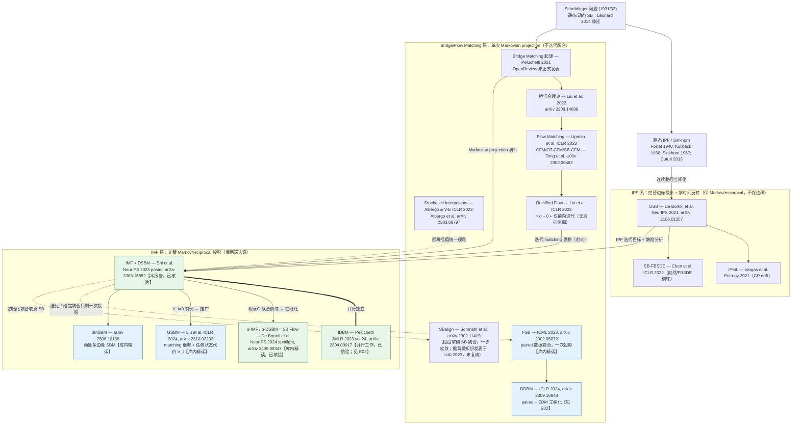

# E01 扩充报告：DSBM 精读 + SB 求解器谱系（IPF/DSB → IMF/DSBM → α-DSBM/SB Flow → bridge matching 系）

## 选题定位

来自 2026-08-14 缺口分析：库内已有 SB Flow（2409.09347，其提出的算法即 α-DSBM）、GSBM（2310.02233）、I²SB（2302.05872）三篇精读，但它们都把 **DSBM** 当背景引用，库内一直缺对 DSBM 本体的精读——尤其是 IMF（Iterative Markovian Fitting）方法论与其收敛性定理的**准确口径**；同时缺一张把 IPF/DSB → IMF/DSBM → α-DSBM/SB Flow → bridge matching 系讲清楚的谱系图。DSBM 是 `SB-Render-Lite` 求解器选型的"分水岭论文"：2023 年之后几乎所有 unpaired SB 求解器都以它为参照系。本报告：(1) DSBM 全文精读（含附录定理、假设与全部实验）；(2) SB 求解器谱系图（mermaid + 缩进树双版本）。并行报告 E02 已给出 IDBM 的定理链笔记，此处 IDBM 只作为谱系节点交叉引用，不重复精读；SB Flow（α-DSBM）库内已有精读，同样不重复。

## TL;DR

- **DSBM**（arXiv 2303.16852，NeurIPS 2023 主会 poster，2026-08-14 已核验）提出 **IMF**：交替做 Markovian projection（把桥混合测度投影到 Markov 类 `M`，reverse-KL 意义下的投影）与 reciprocal projection（投影到参考测度的 reciprocal class `R(Q)`，forward-KL 意义）。它与 IPF 恰成**对偶**：IPF 在两个边缘约束集之间交替投影、迭代天然保持 Markov 与 reciprocal 性质；IMF 在 `M` 与 `R(Q)` 之间交替投影、迭代天然保持两端边缘 `π_0`、`π_T`——这正是 unpaired 翻译最想要的性质。
- **收敛性的准确口径**：在正则性假设 A1–A3 与 Léonard 式 SB 存在唯一性条件下，且要求 `KL(P⁰|P^SB) < ∞`，则 (i) `KL(Pⁿ|P^SB)` 单调不增，且初始 KL 可按迭代逐项精确分解（Pythagoras 望远镜求和）；(ii) IMF 序列唯一不动点即 SB，`KL(Pⁿ|P^SB) → 0`。这是**渐近**收敛、**无速率**，且是"精确投影"（population 层面）的结论，不覆盖神经网络回归误差与有限样本误差。该收敛定理由并行工作 IDBM（Peluchetti，JMLR 2023）Theorem 2 首先给出，DSBM 给出了更简洁的证明。
- **实操两大设计**：只缓存端点对 `(X_0, X_T)` + 用解析 Brownian bridge 重建中间态（对比 DSB 缓存全轨迹，MNIST 实验省约 30% 运行时间且规避 bridge"遗忘"）；**前向/后向 Markovian projection 交替**以抵消回归不完美带来的边缘漂移（依据是 Markovian projection 的前向/后向双 SDE 表示）。单向迭代（仅前向或仅后向，含 Rectified Flow）会把终端边缘误差越迭代越放大。
- 对 `SB-Render-Lite`：DSBM-IMF（独立耦合初始化）是 unpaired sim↔real 的"边缘保持"正统基线；α-DSBM/SB Flow 是它的在线化工程升级。熵正则 σ² 是 realism–alignment 旋钮，且 SB 对分辨率上采样**不不变**（有效正则 ≈ ε/f²），换分辨率/latent 空间必须重调 σ。

---

# Part A · DSBM 精读

## A1 基本信息

- 论文：Diffusion Schrödinger Bridge Matching
- 方法名 / 方法论名：DSBM（算法）/ IMF（Iterative Markovian Fitting，方法论）
- 作者：Yuyang Shi*（Oxford）、Valentin De Bortoli*（ENS Ulm）、Andrew Campbell（Oxford）、Arnaud Doucet（Oxford）；* 同等贡献
- 会议：**NeurIPS 2023 主会（poster）**。核验（检索日期 2026-08-14）：papers.nips.cc 2023 正会论文集收录（"37th Conference on Neural Information Processing Systems (NeurIPS 2023)"）；nips.cc/virtual/2023/poster/70330 标注为 Poster（非 spotlight/oral）；ACM DL 收录于 Proceedings of the 37th NeurIPS。非 workshop、非纯预印本。
- 链接：https://arxiv.org/abs/2303.16852 ｜ 全文精读采用 arXiv HTML 全文（ar5iv 同版）
- 代码：https://github.com/yuyang-shi/dsbm-pytorch（论文脚注给出）
- 归类：unpaired transport；entropic OT / Schrödinger Bridge 数值求解；bridge matching 的迭代化。
- 本报告获取情况：**获得全文**（正文 + 附录 A–J，含证明与实验细节），以下内容基于全文精读；凡属我的推断均以【推断】标注。

## A2 一句话总结

DSBM 把"求 SB"重写为"在 Markov 类与 reciprocal 类之间交替投影"（IMF），其中 Markovian projection 恰好就是 Bridge Matching 回归、reciprocal projection 只需采样端点对再插 Brownian bridge，从而得到一个每步都保持两端边缘、比 DSB 更稳更省、并把 DDM / Bridge Matching / Flow Matching / Rectified Flow / OT-CFM 全部收编为特例或极限的 SB 求解器。

## A3 动机与问题设定

论文事实：

- DDM 与 Bridge/Flow Matching 能在两个任意分布之间搭建 SDE/ODE transport，但**不保证**接近 OT map（W₂ 最优）。SB 问题是动态熵正则 OT：`P^SB = argmin{ KL(P|Q) : P_0=π_0, P_T=π_T }`，参考测度 `Q` 取 `σB_t` 时，其静态投影 `Π^SB_{0,T}` 就是熵正则 OT 耦合，σ→0 恢复经典 OT（Benamou–Brenier）。
- 已有可扩展 SB 数值法基本都走 **IPF**（Fortet 1940；Kullback 1968；Sinkhorn 的连续版）：DSB（De Bortoli et al.，NeurIPS 2021，据本文引用）、IPML（Vargas et al.，Entropy 2021）、SB-FBSDE（Chen et al.，ICLR 2022）。IPF 每半步学一个时间反转扩散，问题是：(i) 需要缓存全轨迹、受时间离散化误差影响；(ii) 数值误差跨迭代累积，出现对参考 bridge 的"遗忘"（Fernandes et al. 2021 的观察）——即迭代若干轮后 `P̃ⁿ` 事实上已不在 `R(Q)` 里，解偏离原 SB 问题。
- 问题设定：给定 `π_0`、`π_T` 的样本（unpaired），与参考 SDE `dX_t = f_t(X_t)dt + σ_t dB_t`，求 SB。

## A4 方法核心

### A4.1 SB 的四条件刻画与两个投影算子

论文事实（Section 3.1）：

SB 是**同时**满足以下四条的唯一路径测度（Prop 5，援引 Léonard 2014 Theorem 2.12）：

1. `P_0 = π_0`；2. `P_T = π_T`；3. `P ∈ M`（Markov 扩散类）；4. `P ∈ R(Q)`（Q 的 reciprocal class：与 Q 有相同 bridge，即 `P = P_{0,T} Q_{|0,T}`）。

两个投影算子：

- **Markovian projection**（Def 1 / Prop 2）：对桥混合测度 `Π = Π_{0,T} Q_{|0,T}`，`proj_M(Π)` 是 drift 为 `v*_t(x) = σ_t² E_{Π_{T|t}}[∇log Q_{T|t}(X_T|X_t) | X_t=x]` 的扩散。性质：(i) 它是 reverse-KL 投影 `argmin_{M∈M} KL(Π|M)`；(ii) **保持 Π 的全部时间边缘**（`M*_t = Π_t, ∀t`，经由同一 Fokker–Planck 方程 + 解唯一性论证）。`v*` 恰是 Bridge Matching 回归（式 4/6）的最优解——这是"IMF 可以用 matching 实现"的根源。
- **Reciprocal projection**（Def 3 / Prop 4）：`proj_{R(Q)}(P) = P_{0,T} Q_{|0,T}`，即保留端点联合分布、把中间路径换成参考 bridge。它是 forward-KL 投影 `argmin_{Π∈R(Q)} KL(P|Π)`。

注意两个投影**互不保持对方的类**：Markovian projection 一般破坏 reciprocal 性，reciprocal projection 一般破坏 Markov 性——所以需要迭代。

### A4.2 IMF 与 IPF 的对偶

论文事实（Fig. 1 的对照表 + Section 3.2）：

| | 交替投影的集合 | 迭代中天然保持的性质 |
|---|---|---|
| IPF | `{P: P_0=π_0}` 与 `{P: P_T=π_T}` | Markov 性、reciprocal 性 `R(Q)` |
| IMF | `M` 与 `R(Q)` | 两端边缘 `P_0=π_0` **且** `P_T=π_T` |

IMF 迭代：`P^{2n+1} = proj_M(P^{2n})`，`P^{2n+2} = proj_{R(Q)}(P^{2n+1})`，初始化 `P⁰ ∈ R(Q)` 且两端边缘正确（如独立耦合 `π_0 ⊗ π_T` 插 Brownian bridge）。由 Prop 2 的边缘保持性 + reciprocal projection 只动路径不动端点，**每个 IMF 迭代都是 π_0→π_T 的合法 transport**。这与 IPF 形成镜像：IPF 每半步只能钉住一端边缘，另一端在收敛前始终是错的。

【推断】这一对偶正是两条路线数值行为差异的根源：IPF 的误差表现为"reciprocal 性丢失"（解漂移出原问题的可行域），IMF 的误差表现为"Markov 化不精确"（回归误差），后者可以用回归精度和前后向交替直接控制，而前者没有内生的纠正机制。

### A4.3 收敛性声明的准确口径（重点）

论文事实（Lemma 6、Prop 7、Theorem 8 及附录 C 的正式版本）：

1. **Pythagoras 引理（Lemma 6）**：`M ∈ M`、`Π ∈ R(Q)` 且相应 KL 有限时，
   `KL(Π|M) = KL(Π|proj_M(Π)) + KL(proj_M(Π)|M)`，
   `KL(M|Π) = KL(M|proj_{R(Q)}(M)) + KL(proj_{R(Q)}(M)|Π)`。
   值得强调：`M` **不是凸集**（论文 C.9 给出显式反例），因此不能直接套用 Csiszár 1975 的凸集 I-投影理论；这里的第一式是对 reverse KL 专门证明的。
2. **单调性（Prop 7）**：`KL(P^{n+1}|P^SB) ≤ KL(Pⁿ|P^SB) < ∞`，且 `KL(Pⁿ|P^{n+1}) → 0`。证明是把 Lemma 6 望远镜化：`KL(P⁰|P^SB) = Σᵢ KL(Pⁱ|P^{i+1}) + KL(P^{N+1}|P^SB)`——初始 KL 预算被逐迭代精确瓜分。对照：IPF 的经典结果（Rüschendorf 1995）是相邻迭代 forward-KL `KL(P̃^{n+1}|P̃ⁿ) → 0`；IMF 这里是 reverse 方向（`Pⁿ` 在左）。
3. **收敛定理（Theorem 8）**："Under mild assumptions"，IMF 序列有唯一不动点 `P* = P^SB`，且 `lim_{n→∞} KL(Pⁿ|P*) = 0`。证明路线：KL(·|P^SB) 的 coercivity ⇒ 迭代序列落在相对紧的 KL 子水平集；`M` 与 `R(Q)` 在弱收敛下闭；KL 弱拓扑下下半连续 ⇒ 聚点 `P* ∈ M ∩ R(Q)` 且两端边缘正确 ⇒ 由四条件唯一性（Prop 5）即 SB。
4. **"mild assumptions" 的实际内容**（附录 C 正式化）：
   - **A1**：`f`、`σ` 与投影 drift 局部 Lipschitz；`f` 线性增长；`C ≥ σ_t ≥ 1/C`（噪声上下有界，**排除 σ→0 的确定性极限**）；投影 drift 线性增长。
   - **A2**：`Π_{T|0} ≪ Q_{T|0}` 且密度比有界；Doob h-函数 `φ_{t|0}` 满足 `1/φ` 与 `Aφ` 有界（保证 h-transform 良定）。
   - **A3**：`∇log φ_{t|0}` 线性增长。
   - 加上 Prop 5 的 Léonard 式条件（`KL(π_0|Q̄)、KL(π_T|Q̄) < ∞`、密度比下界、可积性）与 `KL(P⁰|P^SB) < ∞`。论文自述这些条件"could be relaxed on a case-by-case basis"。
5. **归属**：收敛结论首见于并行独立工作 Peluchetti 2023（IDBM，Theorem 2）；DSBM 论文明确致谢并自称给出 "a simpler proof"（C.6）。两者同为 IMF 思想的并行发现者。
6. **口径边界**（引用时务必带上）：
   - 渐近收敛，**无收敛速率**（正文层面；论文附录 D 只在一维 Gaussian 情形给出显式迭代分析）。
   - 结论针对**精确投影**（population 级 IMF）。DSBM 的两类现实误差——Markovian projection 的神经网络回归误差、缓存采样与 SDE 离散化误差——**不在定理覆盖范围内**；论文的应对（前后向交替）是有原理支撑的偏差缓解手段（见 A4.4），但没有端到端误差传播定理。
   - `σ_t ≥ 1/C > 0` 是硬性假设：Rectified Flow（σ=0）不在该理论保护伞下，这也是论文强调 SDE 路线的理论理由（uniqueness 论证要求 σ>0；RF 不保证收敛到 dynamic OT，论文援引 Liu 2022 的反例）。

### A4.4 DSBM 算法：投影的数值实现与前后向交替

论文事实（Section 4）：

- **Reciprocal projection 的实现**：模拟当前模型 SDE 得到端点对 `(X_0, X_T)` 存入 cache（**只存端点**，不存全轨迹——与 DSB 的全轨迹 caching 关键区别），训练时对任意 `t` 用解析 Brownian bridge `X_t = (1−t/T)X_0 + (t/T)X_T + σ√(t(T−t)/T) Z` 即时重建中间态。
- **Markovian projection 的实现**：Bridge Matching 回归（式 19 前向 / 式 23 后向），任意时刻 `t` 可直接评估损失，simulation-free。
- **为什么必须前向/后向交替**：纯前向 IMF 数值上表现差（论文 Fig. 2 实验佐证）——回归不完美使 `M^{n+1}_T ≠ π_T`，且此偏差逐迭代累积。Prop 9 证明 Markovian projection 同时有前向 SDE（从 `Π_0` 出发）与后向时间反转 SDE（从 `Π_T` 出发）两个等价表示；因此交替使用"从 π_0 起的前向投影"与"从 π_T 起的后向投影"，每次都把上一轮在另一端累积的边缘偏差清零。Algorithm 1 即：反复 [后向回归 → 端点缓存 → 前向回归 → 端点缓存]。
- **初始化家族**（Prop 10）：
  - `Π⁰_{0,T} = Q_{0,T}`（参考过程前向耦合）→ **DSBM-IPF**：在函数类足够丰富时逐迭代复现 DSB 的 IPF 序列（`Mⁿ = P̃ⁿ`），但训练法完全不同（matching + 端点缓存 vs 时间反转 + 全轨迹缓存），从而规避离散化误差与 bridge 遗忘。
  - `Π⁰_{0,T} = π_0 ⊗ π_T`（独立耦合）→ **DSBM-IMF**：纯 IMF 路线，第一迭代恰为标准 Bridge Matching。
  - `Π⁰_{0,T} = 小批量 EOT 耦合`（Sinkhorn on minibatch）→ **DSBM-IMF+**：更优初始化，实验上误差更低。
- **统一特例表**（Section A.2）：Brownian bridge + 独立耦合 + 一次前向投影 = Bridge Matching；再取 σ→0 = Flow Matching；σ→0 且**只做前向**迭代 = Rectified Flow（即 RF ≈ DSBM-IMF 的确定性退化 + 放弃后向纠偏）；初始耦合取 minibatch OT = OT-CFM（第一迭代）；给定真 SB 静态耦合 = SBalign（一步收敛）；DDM = DSBM-IPF 的第一个半迭代。
- **概率流 ODE**：收敛后 `v_φ*(t,x) = −v_θ*(t,x) + σ_t²∇log P*_t(x)`，可组装 PF-ODE `dZ_t = {f + ½(v_θ − v_φ)}dt` 用于似然计算与确定性采样；但注意 `(Z_0, Z_T)` **不是** EOT 耦合（只有边缘对，路径测度不同）。

### A4.5 附录 G：前后向联合训练与一致性损失——α-DSBM 的种子

论文事实：附录 G 提出可以在同一耦合下**同时**训练前向 `v_θ` 与后向 `v_φ`（两者在函数类足够丰富时给出同一个 Markovian projection），新耦合取两方向端点分布的等权混合；并推导出一致性关系 `v_θ(t,x) + v_φ(t,x) = σ_t²∇log Π_t(x)`（σ→0 时退化为 `v_θ = −v_φ`，即 ODE 反转只翻符号），据此构造 consistency loss（有 implicit score matching 版与 denoising 版，后者免散度计算），总损失 `L(θ) + L(φ) + λ L_cons`。

【推断】这一节是 SB Flow（α-DSBM，NeurIPS 2024）的直接前身：α-DSBM 把"每个 outer iteration 完整解一次回归"松弛为"沿同一目标做步长 α 的在线梯度步 + EMA 参数做自采样"，消除了 DSBM 的 cache 刷新、双损失交替与内循环收敛要求；其 α-IMF 对 α=1 恰退回 IMF。DSBM→α-DSBM 的关系可概括为"块坐标下降 → 梯度流离散化"。

## A5 实验与主要结论

论文事实（保留关键数字）：

- **2D 玩具集**（20 步 Euler 的 W₂）：DSBM 全面优于 DSB（如 scurve 0.140 vs 0.272）；不用 OT solver 的前提下优于 FM/CFM；低维时 OT-CFM（用了 minibatch OT）最强。**moons→8gaussians 这种"一般迁移"任务**上 RF 明显崩（1.522 vs DSBM 0.812–0.838）——σ→0 + 仅前向的组合在跨分布迁移上不可靠。DSBM-IMF+ 在 SB 方法中误差最低。路径能量上 DSBM 三变体相近且低于 CFM。
- **50 维 Gaussian**（真 SB 解析已知）：均值各方法都对；**方差与端点协方差**上 DSB、仅后向的 IMF-b、RF 随迭代漂移，DSBM 不漂移。边缘 KL(×10⁻³, d=50)：DSB 32.8、SB-CFM 49.4、DSBM-IPF 8.75、DSBM-IMF 9.76——高维下 minibatch 类方法（SB-CFM）误差随维度暴涨，DSBM 保持精度。
- **MNIST↔EMNIST**：DSB 训到 30 轮外迭代后样本质量崩坏、RF 逐轮退化，DSBM 持续改善；运行时间比 DSB 省约 30%。EMNIST→MNIST：Bridge Matching FID 17.14 / 输入-输出 MSD 0.579；DSBM-IPF 15.27 / 0.354；DSBM-IMF 10.59 / 0.375——**DSBM 相对 BM 的主要收益是对齐性（MSD 几乎减半）同时 FID 更好**。
- **CelebA 64/128（male/old ↔ female/young）**：σ² ∈ {0.01, 0.1, 1, 10} 扫描——FID 随 σ 先降后升，LPIPS（对齐性）随 σ 单调变差：σ 是 realism–alignment 旋钮。同一 σ=1 下 128×128 比 64×64 对齐更好；附录 C.10 / Prop 12 给出理论解释：**上采样 f 倍后同一 σ 对应的有效熵正则缩小 f² 倍**（SB 不随分辨率不变），呼应"噪声调度应随分辨率缩放"的 diffusion 经验。
- **AFHQ 512×512 cat↔wild**：直接在 512² 像素空间跑通，展示可扩展性（定性结果）。
- **无配对流体降尺度（64→512 super-resolution，无配对）**：DSBM-IPF/IMF 的重建对低分辨率源的 ℓ₂ 一致性全频段显著优于 Diffusion-fb（SDEdit 式双扩散）；且发现两变体收敛前偏差方向不同——**DSBM-IMF 无条件统计量（谱、KDE）更准，DSBM-IPF 对源的条件一致性更好**，与"IMF 保边缘、IPF 不保"理论一致。
- **CIFAR-10 生成**（负结果，作者自报）：DSBM-IMF 4.511 vs BM 5.427（σ²=0.2，100 步 Euler），优于 BM 且多迭代有益（RF 恰相反，1 轮 rectify 后 FID 变差）；但相对 FM 4.931 提升有限，且 dopri5 下 FM 4.055 更好。作者结论：**DSBM 的价值在一般 transport 任务，纯生成建模收益不大**。

## A6 局限性

论文自述：

- 生成建模任务收益有限（CIFAR-10）。
- 训练非 sampling-free：每次刷新缓存要模拟当前模型 SDE。
- σ 越小 EOT 数值上越难解（接近 OT 极限时迭代数与误差都会恶化）。

【推断】补充四点：

- 收敛理论是 population 级、渐近、无速率；A1–A3（尤其 σ 有界远离 0、h-函数正则性）在图像/latent 应用中无法验证，只能当"结构性合理"的信念使用。
- 前后向交替消除的是**端点边缘**偏差，不能消除回归误差对**耦合**（即 EOT plan 本身）的偏差；实验中 DSBM-IPF/IMF 收敛前偏差方向不同即是证据。
- 每个 outer iteration 都要把回归训到位，计算是"多轮完整 DDM 训练"量级（CIFAR-10 上预训练 6 天 + 微调 4 天，4×V100）；这正是 α-DSBM 要解决的痛点。
- 耦合最优性针对像素/latent 空间二次代价的 EOT——**与任务无关**；对机器人应用，语义/几何/动作保持没有任何内生保证（需要 GSBM 式状态代价或外加一致性约束）。

---

# Part B · SB 求解器谱系

范围说明：聚焦"如何数值求解（或绕过）SB/EOT 耦合"这条主线；paired 翻译（I²SB/DDBM）作为"给定耦合的退化特例"挂在 bridge matching 系下。venue 标注检索日期 2026-08-14；标"已核验"者为今日 web 复核，其余以论文引用信息/库内报告为据。

## B1 谱系图（mermaid）



## B2 谱系缩进树（备用纯文本版）

```
SB/EOT 求解器谱系（→ 表示方法论继承；‖ 表示并行独立）
├── 静态：Sinkhorn/IPF（Fortet 1940; Kullback 1968; Sinkhorn 1967; Cuturi 2013）
├── IPF 系（交替边缘投影，学时间反转；保 Markov+reciprocal，不保两端边缘）
│   ├── DSB — De Bortoli et al., NeurIPS 2021（全轨迹缓存；误差累积 + bridge 遗忘）
│   ├── IPML — Vargas et al., Entropy 2021（GP drift 版）
│   └── SB-FBSDE — Chen et al., ICLR 2022（FBSDE/似然训练版）
├── Bridge/Flow Matching 系（单次 Markovian projection；不迭代耦合，因此不解 SB 耦合）
│   ├── Bridge Matching — Peluchetti 2021（OpenReview，未正式发表）；Liu et al. 2022（2208.14699）
│   ├── Flow Matching — Lipman et al., ICLR 2023；CFM/OT-CFM/SB-CFM — Tong et al.（2302.00482）
│   ├── Stochastic Interpolants — Albergo & Vanden-Eijnden, ICLR 2023；Albergo et al.（2303.08797）
│   ├── Rectified Flow — Liu et al., ICLR 2023 ＝ σ→0 + 仅前向迭代（终端边缘偏差随迭代累积）
│   └── paired 退化特例（耦合由数据给定，一次投影即可）
│       ├── I²SB — ICML 2023（2302.05872）【库内精读】
│       ├── SBalign — Somnath et al.（2302.11419；假设耦合即 SB 耦合）
│       └── DDBM — ICLR 2024（2309.16948）【E02 精读】
└── IMF 系（交替 Markov/reciprocal 投影；每步保持两端边缘 = 每步都是合法 transport）
    ├── IMF/DSBM — Shi, De Bortoli, Campbell, Doucet, NeurIPS 2023 poster（2303.16852）【本报告】
    │   ‖ IDBM — Peluchetti, JMLR 2023 vol.24（2304.00917）【并行独立；E02 有定理笔记】
    ├── α-IMF / α-DSBM ＝ SB Flow — De Bortoli et al., NeurIPS 2024 spotlight（2409.09347）【库内精读】
    │     （块坐标下降 → 梯度流离散化：在线微调、EMA 自采样、免缓存/双损失交替；α=1 退回 IMF）
    ├── GSBM — Liu et al., ICLR 2024（2310.02233）【库内精读】
    │     （最小动能 → 动能 + 任务状态代价 V_t；条件 SOC 求中间路径；DSBM 是 V_t=0 特例）
    └── 3MSBM — （2506.10168）【库内精读】（动量 + 多边缘：轨迹/视频级桥）
```

## B3 谱系要点注释

- **IPF 与 IMF 的分界不是"新旧"而是"投影对象"**：IPF 系投影边缘约束集、IMF 系投影结构类（Markov/reciprocal）。DSBM-IPF（Prop 10）证明两条路线在理想函数类下产生同一迭代序列——差别全在数值实现的误差结构上。
- **bridge matching 系是 IMF 的"半步"**：一次 Markovian projection = Bridge Matching；所以该系方法（含 FM/SI）不解 SB 耦合，只在给定耦合下做正确的边缘桥接。paired 方法（I²SB/DDBM/SBalign）本质是"耦合由数据或假设直接给定，于是半步就够了"。
- **RF 的位置要谨慎**：RF 是"迭代式 matching"的先驱，但 σ=0 + 仅前向两点使它既失去 SB 理论保证（σ>0 才有唯一性）、又失去后向纠偏（终端边缘逐轮漂移，DSBM 论文在 2D/Gaussian/MNIST 三处实验演示了这一退化）。
- **α-DSBM 不改变 IMF 的数学对象，只改变优化调度**；谱系上它是 DSBM 的工程收敛加速版，而 GSBM 改变了目标泛函（加 V_t），是问题层面的推广。

---

# Part C · 与库内已有工作的关系

- **SB Flow / α-DSBM（2409.09347，库内已精读；NeurIPS 2024 spotlight，今日经 OpenReview 复核补充）**：DSBM 是其直接前身与主要对照。本报告补足库内缺口：SB Flow 精读未展开的 IMF 理论基础（四条件刻画、Pythagoras、收敛口径）与 DSBM 的前后向交替机制都在本文；反过来，α-DSBM 解决的正是 A6 指出的"每轮完整训练"痛点。选型上两者是"同一数学对象的两种训练调度"。
- **GSBM（2310.02233，库内已精读）**：GSBM 把 DSBM 的最小动能目标推广为动能 + 状态代价 `V_t`，其算法骨架（matching 更新 drift + 更新耦合）沿用 DSBM，且论文直接以 DSBM 为对照（AFHQ 64² dog→cat：GSBM FID 12.39 vs DSBM 14.16）。谱系关系：DSBM 是 GSBM 的 `V_t = 0` 特例；`SB-Render-Lite` 若要 task-aware 约束应从 DSBM 升级到 GSBM。
- **I²SB（2302.05872，库内已精读）**：在 DSBM 框架下，I²SB = "耦合由 paired 数据直接给定 + 一次 Bridge Matching"（DSBM 附录 A.1 明确指出 I²SB 目标与 BM 目标等价）。分工清晰：有 paired 帧用 I²SB/DDBM，无 paired 用 DSBM/α-DSBM。
- **E02（DDBM 精读 + IDBM 笔记，本轮并行产出）**：IDBM 与 DSBM 是 IMF 的并行独立发现（DSBM 论文自己声明 Theorem 8 首见于 IDBM Theorem 2）。E02 从 IDBM 侧写了定理链；本报告从 DSBM 侧写了假设的准确内容（A1–A3）与数值设计（前后向交替、端点缓存），两份互补，谱系图以本报告为准。
- **3MSBM（2506.10168，库内已精读）**：把 matching 式 SB 求解推广到动量 + 多边缘（轨迹级），是 DSBM 机件在视频/轨迹桥上的延伸，未来做多帧一致 sim2real 翻译时的候选。
- **BDGxRL（2602.23737，库内已精读）**：用 Diffusion Schrödinger Bridge 桥接跨域 RL 的 dynamics gap，属于"SB 求解器的机器人应用"节点；其求解器选型正落在本谱系 DSB→DSBM 的延长线上。

# Part D · 对 SB-Render-Lite 的直接启发（unpaired sim↔real 翻译求解器选型）

【本节为推断/建议】

1. **选型决策树**：paired sim/real 帧可得 → I²SB / DDBM（见 E02 双基线建议）；纯 unpaired → **首选 α-DSBM（SB Flow）做主力、DSBM-IMF 做对照**——α-DSBM 训练调度更省，但 DSBM 的前后向交替版本经受了更多消融检验，两者共享同一收敛对象；需要 geometry/action 状态代价 → GSBM；多帧/轨迹一致性 → 3MSBM。
2. **DSBM-IMF vs DSBM-IPF 的差异可直接变成实验设计**：流体实验显示收敛前 IMF 变体分布统计更准、IPF 变体对源的条件一致性更好。对我们，"对源一致" ≈ 几何/内容保持，"分布准" ≈ 真实感。建议两种初始化都跑，并把（真实域分布指标，对 sim 源的一致性指标）作为二维报告，而非单一 FID。
3. **σ²（熵正则）是核心旋钮且不随分辨率不变**：CelebA 扫描给出 FID–LPIPS 的 U 形/单调权衡；Prop 12 说明上采样 f 倍后有效正则缩小 f²。SB-Render-Lite 在 64²/256² latent/pixel 之间切换时**必须重扫 σ**，且预期最优 σ 随分辨率升高而增大。σ 越小越接近 OT（对齐好）但数值越难、需要更多外迭代——这就是"对齐性预算"的开销侧。
4. **训练配方**：先用独立耦合训 Bridge Matching 至收敛（= DSBM-IMF 第一迭代，也是 α-DSBM 的 pretrain 阶段），再做少量 outer iterations / 在线微调。MNIST 数据点表明主要收益是**输入-输出对齐几乎减半（MSD 0.579→0.375）且 FID 同步改善**——对 sim2real 而言这正是"迁移后动作标签仍有效"的那部分收益，值得单列指标（我们可用 keypoint/depth/inverse-dynamics 一致性代替 MSD）。
5. **DSBM-IMF+ 思路可白嫖**：用 minibatch Sinkhorn 在 DINO/VAE latent 上算初始耦合再插桥，可减少外迭代数；但 50 维 Gaussian 实验警告 minibatch 类耦合在高维本身偏差大，只能当初始化、不能当最终解。
6. **评估协议借鉴**：无配对流体降尺度实验是"unpaired + 结构保持"评估的好模板——分布匹配（谱/KDE）与对源条件一致性（ℓ₂ 分频段）并列报告；对应到我们是 real-domain FID/CMMD + sim 源的几何一致性 + 下游 policy success。
7. **风险提示**：DSBM 家族的耦合最优性是像素/latent 二次代价 EOT，**没有任务感知**；真实感提升不保证接触状态、物体位姿、任务阶段不变。落地时要么上 GSBM 的 `V_t`，要么在 DSBM 损失外挂几何/逆动力学一致性正则，并把"是否加约束"做成消融。

---

## 并入主库建议

1. **INDEX 挂载**：建议将本报告挂到"重要对照 / SB 方法支撑"或新设"SB 求解器方法学"小节，紧邻 `2409.09347_schrodinger_bridge_flow_unpaired_translation.md`；DSBM 作为 SB Flow 的前身、GSBM 的特例基座，是三篇的公共上游，INDEX 的阅读顺序建议改为 DSBM → SB Flow → GSBM。
2. **谱系图独立成页**：Part B 的 mermaid + 缩进树可抽出为 `reports/sb_solver_lineage.md`（或并入 `synthesis.md` 的方法学章节），后续新增求解器（如 LightSB、ASBM，见 E03）时在此图上加节点即可。
3. **可补一篇正式精读文件**：若按主库命名规范，可把本报告 Part A 摘录为 `reports/2303.16852_dsbm.md`（结构对齐 `2504.11713_adjoint_sampling.md` 范式），本扩充报告保留谱系与选型分析。
4. **选型结论回写**：建议在 `synthesis.md` 的 `SB-Render-Lite` 段落更新一句：unpaired 主力求解器定为 α-DSBM（SB Flow），DSBM-IMF 为必跑对照，σ² 扫描 + 双初始化（IMF/IPF）消融进入实验计划；paired 支线维持 E02 的 I²SB + DDBM 双基线结论。
5. **与 E02 的合并注意**：谱系图中 IDBM 节点信息（JMLR 2023 vol.24）与 E02 一致，已核验无冲突；合并主库时二者引用同一节点即可，避免重复建条目。

---

*检索与核验日期：2026-08-14。venue 已核验条目：DSBM = NeurIPS 2023 主会 poster（papers.nips.cc / nips.cc virtual poster 70330 / ACM DL）；IDBM = JMLR 2023 vol.24（jmlr.org 23-0527）；SB Flow = NeurIPS 2024 spotlight（OpenReview 1F32iCJFfa）。其余 venue 以论文参考文献或库内既有报告为据，未逐一独立复核者已在文中标注。*
